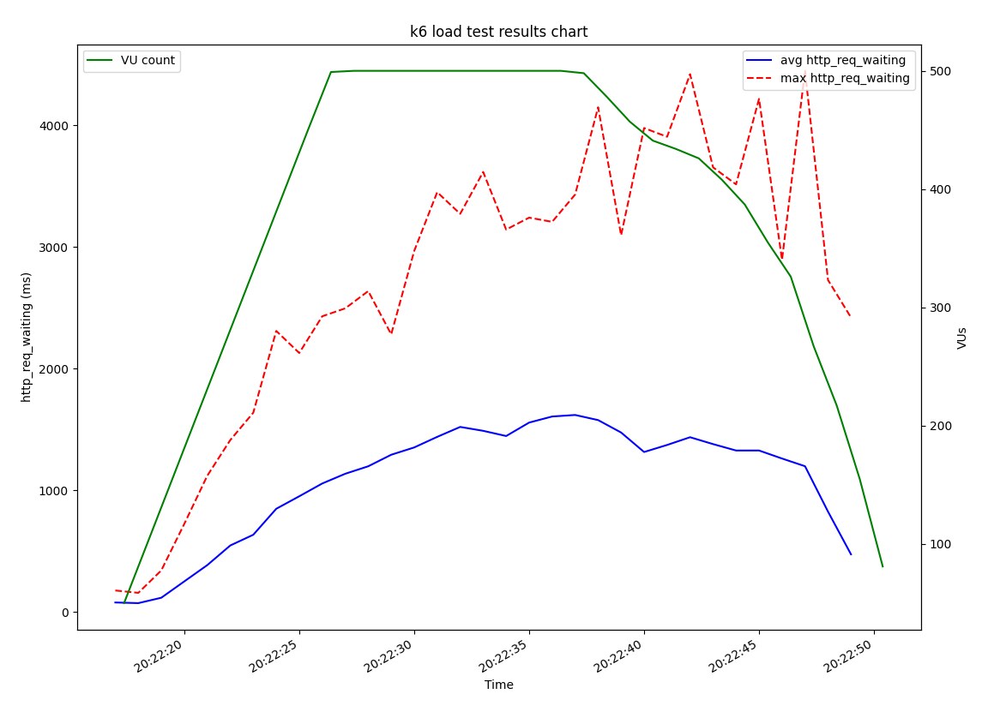

# k6 Test Results Visualization
- a simple tool written in Python for visualization of k6 output
    - when passing `--out json=<file_name>` to the `k6` program all test events are serialized and saved to the given file
    - this file can be later processed and its data visualized
- in the current state it allows for plotting given metric (it's average and maximum value in each minute/second)
    - by default it plots the `http_req_waiting` metric values

## Motivation
- seeing how certain metrics' values change during a load test is quite important as it can provide useful information
    - take average response time changing as the number of VUs increase as an example
- running the k6 tool locally does not offer any visualization
    - all tests run in the k6 cloud offer various charts to be analyzed, but sometimes, when running small load tests, we do not want to use **paid** features of the cloud
- to offer **free** visualization options for local k6 load tests this project was created

# Dependencies
- Python 3 interpreter
- `matplotlib` ([https://pypi.org/project/matplotlib/](https://pypi.org/project/matplotlib/))

# Usage
- run a k6 test and save its output to a file
    - `k6 run --out json=k6_test_results.json test.js`
- `python3 k6_plotter.py k6_test_results.json`
    - plots the `http_req_waiting` metric data by default
- `python3 k6_plotter.py <metric>`
    - plots the data of the metric identified by it's name (`<metric>`)

# TODO
- better argparsing
    - pass file to which the chart should be saved in SVG format
    - toggle whether date should be rounded to seconds/minutes,... (minutes by default right now)
- optimizations
- finish displaying of a histogram 
    - arguments to toggle this feature are missing right now
